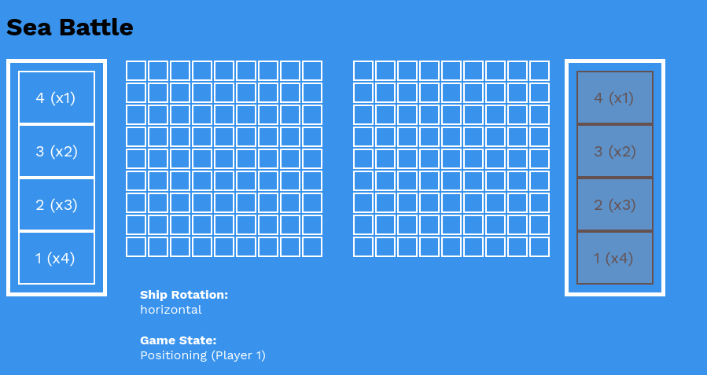
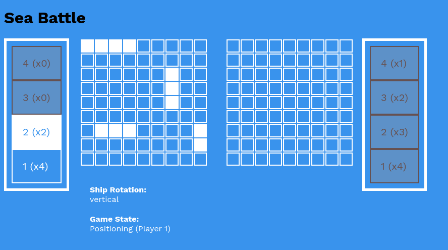
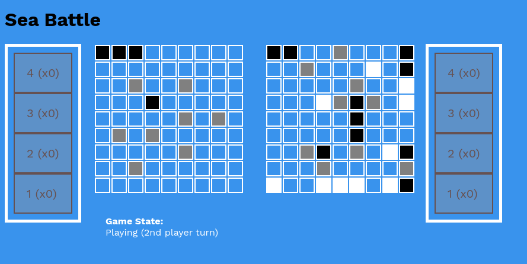
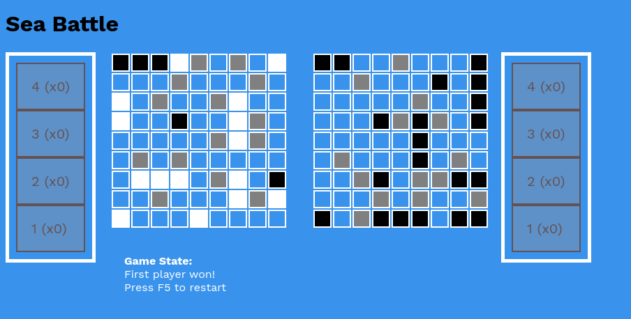

# Sea Battle Project
This project is created as course work for the first year in KPI. It is a web version of the classic "Sea Battle" game which can be played offline in browser. There are no third-party libraries in use.  

The game is divided in 3 states:

- Postioning (for both players)
- Playing (for each turn)
- End

The game's rules are simple, just like in original one you have 4 types of ships with different size (can be changed in `config.js`):

- x1 4-sized
- x2 3-sized
- x3 2-sized
- x4 1-sized

Firstrly, in positioning state both players place their ships on the field. Ship rotation can be changed by clicking on "Ship rotation" text. 

In second part players shooting each other's field. If player aimed in ship he continues his turn till he miss.

The game ends when one of the players lose all his ships. It means that his opponent is a winner :) 
# Gameplay screenshots

   
## Positioning  

## Playing

## Game End
